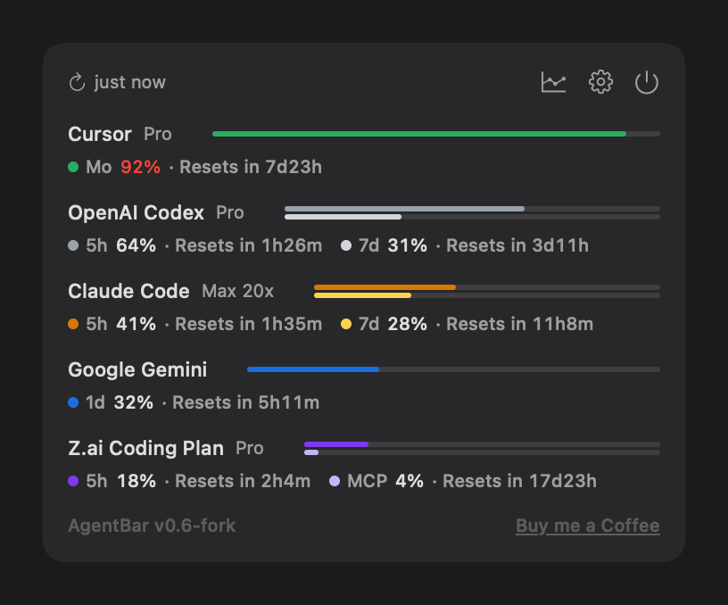
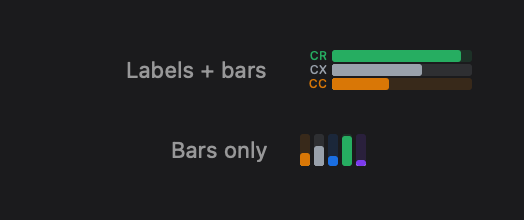

# AgentBar

<p align="center">
  
</p>

[](https://developer.apple.com/documentation/security/notarizing_macos_software_before_distribution)
[](#install)
[](#build)

macOS menu bar app that tracks AI coding assistant usage in one place.

> **This is a fork of [scari/AgentBar](https://github.com/scari/AgentBar)** with a reworked menu bar
> and popover. See [what's different](#differences-from-upstream). Builds published here are signed
> and notarized under a different developer account than upstream's.

<p align="center">
  
</p>

## Supported Services

| Service | Data Source | Windows |
|---------|-------------|---------|
| Claude Code | Anthropic OAuth API (Keychain credential) | 5h, 7d |
| OpenAI Codex | Local session logs (`~/.codex/sessions/`) | 5h, 7d |
| Google Gemini | Local logs (`~/.gemini/tmp/`) | 1 day |
| GitHub Copilot | GitHub Copilot API (gh CLI token or PAT) | Monthly |
| Cursor | Cursor API + local SQLite DB | Monthly |
| Z.ai | Z.ai quota API (API key from Keychain) | 5h, monthly MCP |

Claude Code and OpenCode also feed desktop notifications through their hook systems.

## Features

**Menu bar**

<p align="center">
  
</p>

- Two styles: labelled rows, or compact vertical columns where colour alone identifies each agent
- Compact sizes itself to the number of active agents — one agent takes 9pt of menu bar
- Rows are ranked by usage, so whatever is closest to its limit stays visible

**Popover**

- One row per service: a stacked bar with a track per window, and a colour-keyed legend chip
  showing usage and time until reset
- Sizes itself to its contents; scrolls only if the list would outgrow the screen
- Refresh on demand, or read how long ago the last poll landed

**Insights**

- Separate window charting daily peak usage per service over 12 weeks
- Daily heatmap, trend line, and reset-cycle consistency with completion streaks

**Everything else**

- Desktop notifications for agent events (Claude hooks, Codex watcher)
- Per-provider enable/disable, with settings revealed only for enabled providers
- Configurable refresh interval, plan/limit controls, Keychain-backed API key storage
- Sound pack support via the CESP registry

## Install

Download `AgentBar.dmg` from [Releases](https://github.com/alancwoo/AgentBar/releases), open it, and
drag AgentBar to Applications.

The app is signed with a Developer ID certificate and notarized by Apple, so it opens without
Gatekeeper warnings. It is not sandboxed — it reads local agent logs, a Cursor SQLite database, and
Keychain credentials, all of which the sandbox would block.

## Differences from upstream

- **Compact menu bar style** — one thin colour-coded column per agent instead of labelled rows
- **Redesigned popover** — merged chrome, legend chips with reset countdowns, per-window bar tracks,
  content-sized height, and dismissal when you click away to another app
- **Insights moved out of Settings** into its own window, charting only providers you have enabled
- **Collapsible provider settings** — each provider is a single row until switched on
- **Claude plan auto-detection** from the Claude Code credentials, instead of a manual picker
- **Fixes**: Copilot's `gh` lookup under launchd's minimal `PATH`, unit tests recording mock usage
  into the real history file, sound-pack path traversal, event-socket permissions, and release
  builds reporting the wrong version string

## Build

```sh
# Build & run
xcodebuild build -project AgentBar.xcodeproj -scheme AgentBar -configuration Debug -derivedDataPath build -quiet
open build/Build/Products/Debug/AgentBar.app

# Test (serial workers, no system keychain integration tests)
./scripts/test.sh

# Optional: include the system Keychain integration test
AGENTBAR_RUN_SYSTEM_KEYCHAIN_TESTS=1 ./scripts/test.sh
```

Notes:
- `scripts/test.sh` defaults to `-parallel-testing-enabled NO` with one worker, to avoid repeated
  macOS security prompts.
- The project file is generated: after adding or removing source files, run `xcodegen generate`.

### Release

Requires a Developer ID Application certificate, a `notarytool` keychain profile named `AgentBar`,
and `create-dmg`:

```sh
xcrun notarytool store-credentials "AgentBar" --apple-id <id> --team-id <team> --password <app-specific>
brew install create-dmg

git tag vX.Y                                     # the footer shows the tag when HEAD is on one
DEVELOPMENT_TEAM=<team> ./scripts/release.sh     # archive, sign, notarize, staple, DMG
DEVELOPMENT_TEAM=<team> ./scripts/verify-release-signing.sh --require-notarized
```

## Support

AgentBar was created by [scari](https://github.com/scari) — please support the original author:

[](https://github.com/sponsors/scari)
[](https://buymeacoffee.com/_scari)

## License

MIT License. See [LICENSE](LICENSE).
